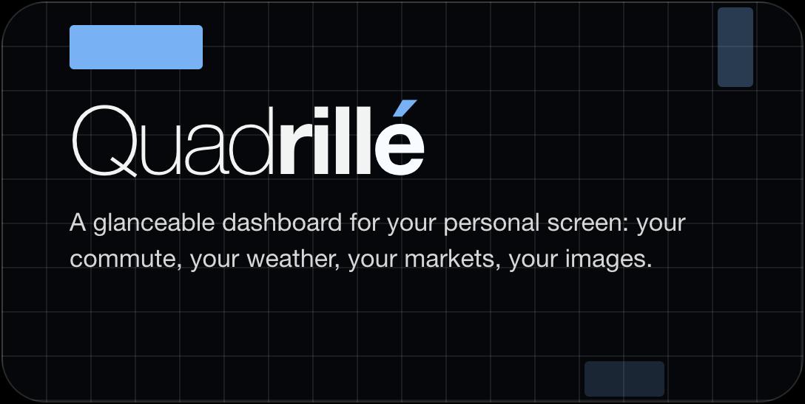

<p align="center">
  <a href="https://quadrille.io"></a>
</p>

A lightweight, personal signage dashboard — **Quadrillé** (`quadrille.io`) —
for touch enabled Cisco RoomOS endpoints such as the Board Pro and Desk Pro:
worldwide weather and surf, transit boards (NYC Subway status, LIRR,
Metro-North, NJ Transit, Amtrak, PATH, NYC Ferry, Express Bus, Citi Bike;
London TfL status), market tickers, sports scores, headlines, cloud-service
status, public-domain art, photo slideshows, and daily extras (NASA's photo of
the day, Statista's chart of the day, and more). Hosted entirely on the
public internet, personalized per device **without authentication**, with
preferences that survive reboots and RoomOS upgrades.


<table>
  <tr>
    <td width="50%"></td>
    <td width="50%"></td>
  </tr>
</table>


*Two example layouts; the on-board edit mode (every card drags and resizes on
the touchscreen, with live capacity hints); and the full-screen art screensaver
with its ambient info band.*

## How it works

```
┌─ Static site (Cloudflare Pages) ─────────────────────────────┐
│ /        dashboard (widgets, ambient art, touch settings)    │
│ /setup   companion page → 6-char setup code                  │
│ /photo-setup  album/folder walkthrough → photos-only code    │
│ /video-setup  stream-link preview      → video-only code     │
│ /info    the widget guide (what every card does) + changelog │
└──────────────────────────────────────────────────────────────┘
┌─ Cloudflare Worker (worker/) ────────────────────────────────┐
│ /code            setup-code exchange (KV, 1h TTL, single-use)│
│ /njt/*           NJ Transit proxy (their ToS requires one)   │
│ /markets         tickers via Yahoo, cached 5 min             │
│ /alerts/*        MTA service-alert digests (subway/lirr/mnr) │
│ /amtrak/departures     NYP board from the Amtraker feed      │
│ /sports/team     ESPN digest + live scoreboard score join    │
│ /golf, /tennis, /f1    digested leaderboards + standings     │
│ /news/*, /posts/substack     RSS + posts whitelist proxies   │
│ /bus/stops, /path/realtime, /ferry/departures,               │
│ /citibike/status, /tfl/status      more transit digests      │
│ /icloud/album, /gdrive/album       photo-album digests       │
│ /services/status, /apod, /chart    status pages · NASA photo │
│                                    · Statista chart of day   │
│ /fleet           anonymous usage ping → Analytics Engine     │
│ /health          content checks over the upstreams (+ cron)  │
└──────────────────────────────────────────────────────────────┘
┌─ Each Board Pro ─────────────────────────────────────────────┐
│ Dashboard macro (paste-and-go) configures + shows signage    │
│ localStorage (signage profile) = primary store               │
│ URL fragment: #cfg=<config>&auth=<bridge creds>              │
└──────────────────────────────────────────────────────────────┘
```

- Weather/AQI/marine (Open-Meteo), NWS alerts, LIRR + Metro-North GTFS-RT
  (decoded by a small hand-rolled protobuf reader, `site/js/gtfs.js`,
  oracle-tested against `gtfs-realtime-bindings`), art (Met / Art Institute of
  Chicago / Cleveland), Bluesky, and history (Wikimedia) are fetched **directly
  from the browser** — all verified CORS-open and keyless. Everything else
  (subway alert digests, Amtrak, PATH, ferry, bus, Citi Bike, TfL, sports,
  news, Substack, photo albums, cloud-service status, NASA photo, the Statista
  chart) rides the Worker's Cache-API layer.
- Config is deflate+base64url JSON (~200 chars). localStorage is the primary
  store; the same string also rides the signage URL's `#cfg=` fragment, so a
  board re-seeds its configuration from the URL after a web-storage wipe.

### The page is a fixed canvas, not a viewport

`site/css/main.css` pins `html, body` to exactly **1920×1080 CSS px** on every
device. That is deliberate: the grid, the editor and the settings overlay then
have identical geometry everywhere, and the per-widget capacity tables in
`site/js/capacity.js` are measured once, against that page, instead of against a
per-device matrix.

The real screens differ from it, and this is the part that is easy to get wrong:

| Device | Viewport handed to the page | Bottom bar |
|---|---|---|
| Board Pro / Desk Pro (signage) | **1920×1040** | RoomOS draws its "Tap here to start" bar in the 40 physical px **below** the viewport |
| Room Navigator (PWA) | **1920×1200** | none |
| Desktop preview | whatever the window is | none |

The bar does **not** overlay page content. What happens instead is that the last
40px of the fixed 1080px page fall off the bottom of a board's glass — which
crops anything parked there exactly as an overlay would have, which is why the
overlay theory survived as long as it did. The `--safe-bottom: 84px` reserve is
what keeps the page's own content (grid, settings, editor) clear of that edge;
don't spend it without re-measuring on a device.

Only the `position: fixed` full-screen contexts — the expand overlay, the
screensaver, the image viewer — are sized by the *real* viewport, and they model
against 1040, the smallest height any supported device gives them
(`BOARD_VIEWPORT_H` in `site/js/expand.js`). `test/overlay-chrome.test.js` reads
the chrome dimensions back out of the stylesheet and re-derives the numbers, so
a CSS edit cannot silently invalidate them.

## Widgets

Everything is opt-in. Tap the **✎ pencil** to add, remove, resize and arrange
widgets on the 12×8 grid; the add tray groups them into the eight categories
below, and **Settings → Widgets** is a signpost to the same place (it carried
its own toggle list until 2026-08-01, which was a second, worse editor: minimum
size only, and no way to say what fits). Each widget has a minimum size and
shows more content as you make its card bigger (the edit screen tells you how
many rows fit). A few widgets have **two** legal minimums rather than one, via
`MIN_ALTS` in `site/js/layout.js`: World Clock is canonically 2×3 (five cities)
but 3×2 is equally legal and fits three, and Word of the Day works the same way,
since neither fits a 2×2 square but both fit either rectangle. The edit tile
names whichever minimum the card is actually in, so a perfectly legal 3×2 never
reads "3×2 · min 2×3" and contradicts itself. The clock/greeting across the top
is always on. Every widget degrades gracefully: a dead feed dims the card and
stamps "as of …" rather than going blank, and long text taps to full screen.

`WIDGET_IDS` in `site/js/config.js` is the list of every card that exists, and
`WIDGET_GROUPS` is its exact partition into the categories below — the same
labels the on-board add tray, the Settings nav and the phone `/setup` page all
use, so a card sits in the same place wherever you meet it. Not every card that
exists is *offerable*: one predicate, `isAddable(id, cfg, host)`, decides that
(see [Add policy and gated cards](#add-policy-and-gated-cards)).

Configure each widget in its own **Settings** section (on the board by touch, or
from your phone at `/setup`). Configurable list widgets (markets, sports, world
clock, headlines, Substack, Bluesky) ship with sensible starter entries you can
remove like any other.

**Tap to expand.** The rule is that *almost every card opens full screen on a
tap*, and the exceptions are shorter to list than the rule: 24 of the 35 widgets
register an expand view; PATH, Air & Sky, Quote of the Day, Word of the Day and
Live Video have nothing behind the tap; and the six image cards (Art,
Landscapes, both Photos widgets, NASA Daily Photo, Chart of the Day) open the
image viewer instead. Every expand view is built from the render the card is
already holding, so it costs **no extra request** and shows exactly what the
card had at the moment you touched it. By family:

- **List cards** (Markets, Subway, Cloud Services, TfL Status, Citi Bike,
  Express Bus, World Clock and the rail boards) show everything they fetched
  rather than only what fit.
- **Weather**, **Surf** and **Formula 1** open a fuller reading of the same data:
  the wider forecast, the 48-hour marine picture, the whole season.
- The **news family** (Headlines, Markets News, Sports News, Substack, Bluesky)
  opens a reading list, whose rows tap through again to the story itself.
- **My Teams**, **Golf** and **Tennis** open their boards, and **This Day in
  History** opens the whole day.

The rail board sizes itself to its list: one grand centered column up to six
departures, two balanced columns beyond. A service-alert banner on a rail card
is its own tap target and opens that alert's full text, including details the
two-line banner clamps away.

**The "+N" corner badge** is pure information: a count of what the card is *not*
showing. It is never a glyph, and it is never the affordance. Expandability is a
board-wide rule a viewer learns once (every card opens), not per-card chrome, so
a badge never has to advertise it; when a badge looks like it needs a marker, the
answer has always turned out to be that a view is missing, not a mark.

**Idle dismissal is per surface**, not one blanket timeout. The expand overlay
closes after 60 seconds untouched (`site/js/expand.js`), so a board someone
walked away from returns to its resting state on its own. The shared text and
story reader closes after 20 (`site/js/textviewer.js`). The image viewer has **no
idle dismiss at all**, by explicit decision: a picture filling the glass is the
one thing on this board that is fine to leave up (`site/js/imageshow.js`). Long
text anywhere else (a headline, a quote, an incident detail) taps into that
shared reader, which for a news story adds a QR code to the article.

### Commute

Ten cards, NYC-area except TfL. The three commuter-rail boards (**LIRR**,
**Metro-North**, **NJ Transit**) print each row's line name as a filled chip in
the agency's own official colour rather than as one more line of dim text, so
the line reads at a glance instead of looking like a repeat of the destination
above it (`site/js/lines.js`; every colour pair is gated at the 4.5:1 AA
contrast floor by `test/transit.test.js`).

- **Subway Status** — Good Service or the current alert for each line you pick;
  alerting lines float above the quiet ones, and the card taps into the full
  status board. *Configure:* Settings → Subway (tap line bullets; shuttle "S"
  and express variants are matched automatically).
- **LIRR** / **Metro-North** — departure boards with live minutes, track, and
  service alerts. LIRR picks its terminal — Penn Station (default), Grand
  Central, or both, with each row tagged by terminal when both. Metro-North is
  Grand Central. *Configure:* their Settings sections; pick the station your
  trains must stop at (named in the card corner — required, the card prompts
  until one is chosen), and toggle the alert banner.
- **NJ Transit** — scheduled departures from **New York Penn** (fixed, like
  LIRR and Amtrak; named in the card corner) — time, destination, and line.
  RailData's schedule feed carries no live track or per-train status, so live
  delays and disruptions arrive as a service-alert banner instead. Amtrak trains
  that share the station are filtered out (they have their own card).
  *Configure:* Settings → NJ Transit (filter to the lines you ride — none
  selected means all of them; toggle alerts).
- **Amtrak** — departures from Moynihan Train Hall / New York Penn (NYP), with
  route, train number, status, and platform when assigned. Shows trains
  stopping at your destination (named in the card corner) with the arrival
  time there — a destination is required; the card prompts until one is
  chosen. *Configure:* Settings → Amtrak (pick a destination; toggle alerts).
- **PATH** — next trains at one station as colored line dots + minutes; choose
  one direction or both. *Configure:* Settings → PATH.
- **NYC Ferry** — next departures from one landing, with route name and color.
  *Configure:* Settings → NYC Ferry.
- **Express Bus** — arrivals for up to two route + stop picks (choose an
  express route QM/BM/SIM/X, then direction, then stop), in minutes or
  distance. *Configure:* Settings → Express Bus (needs a free BusTime key on
  the Worker; see Data sources — the picker works without it).
- **Citi Bike** — live bikes (e-bikes called out) and open docks at up to six
  stations; defaults to the stations nearest the office. *Configure:* Settings →
  Citi Bike (search a station by its cross-streets). Keyless.
- **TfL Status** — London line status (Tube + Elizabeth line + DLR + Overground):
  a coloured dot + name + "Good Service" / the current disruption per line you
  pick; tap a disrupted line for the full reason. *Configure:* Settings → TfL
  Status (toggle lines by mode). Keyless.

### Weather & Air

One location drives all three cards.

- **Weather** — current conditions, an hourly temperature trend line, and a
  multi-day forecast strip, worldwide (Open-Meteo). US locations also get a
  National Weather Service alert banner when one is active. Tap for the fuller
  picture — a single upstream call serves both the card and the overlay.
  *Configure:* Settings → Weather (search any city worldwide or a 5-digit US
  ZIP). Picking a location defaults the unit by region (US → °F, elsewhere →
  °C); the °F/°C toggle overrides.
- **Air & Sky** — labeled AQI and UV-index dials (color-coded by band), plus
  sunrise, sunset, and the moon phase. *Configure:* none — uses your weather location.
- **Surf** — wave height and period, the swell bearing, water temperature and
  whether the wind is onshore, offshore or cross-shore, over an hourly build
  chart. Tap for the 48-hour picture: the groundswell split out from the local
  wind chop, the week's peaks, and the water paired with the air. Modeled
  (Open-Meteo Marine), not buoy-observed, and the card says how far offshore
  the model cell sits. Every marine field is independently nullable upstream, so
  a spot can legitimately report a wave height and no period. *Configure:* none
  — uses your weather location. The card is only OFFERED where a probe confirms
  open water nearby (see [Place gating](#place-gating-surf)).

### Markets

- **Markets** — Dow / Nasdaq / S&P by default, plus any tickers you add
  (indexes start with `^`), each with a sparkline and change. The card shows as
  many as fit and puts the rest behind a "+N" badge; tap for the full ticker
  wall. Up to **20 symbols** — that ceiling is what the full-screen wall can
  hold without scrolling, and it is enforced identically in the config
  normalizer, the picker and the Worker. *Configure:* Settings → Markets
  (add/remove tickers; unknown symbols are rejected).
- **Markets News** — newest finance stories merged across the sources you
  enable (MarketWatch, WSJ Markets, FT Markets, CNBC, NYT Business, Yahoo
  Finance on by default; Seeking Alpha opt-in). *Configure:* Settings →
  Markets News.

### Sports

- **My Teams** — one glanceable row per followed team: live score, final, or
  next game, with the last result. *Configure:* Settings → Sports → My Teams
  (up to 6, across MLB/NFL/NBA/NHL/MLS/EPL).
- **Sports News** — newest sports stories merged across the sources you enable
  (ESPN, CBS Sports, Yahoo Sports and The Athletic on by default; BBC Sport
  and Guardian Sport opt-in). Sport chips narrow the card to particular sports
  (MLB, NFL, NBA, NHL, MLS, F1, Golf, Tennis) by switching to the per-sport
  feeds of your enabled outlets; ESPN publishes none, so it contributes only
  in all-sports mode. The "Only my teams" switch takes over instead: the card
  reads your teams' league sections directly and keeps only stories naming a
  team you follow (matched on headline and summary, so a nickname-only mention
  can still slip past; the chips gray out while the switch owns the sports).
  *Configure:* Settings → Sports → Sports News.
- **Formula 1** — next Grand Prix, last race's podium, and the driver and
  constructor standings. Team-colour dots and driver country flags; the layout
  adapts to the card size (standings side-by-side when wide, stacked when
  narrow). Tap for the **three-pillar season view**: the next race with its whole
  weekend session schedule and a countdown ("Lights out in 6 days", "Race under
  way"); the last race in full rather than its podium (every classified finisher
  with grid position, points, gap, retirements and the fastest lap); and both
  championships. The next-race pillar draws a circuit map from a bundled outline
  the moment it opens, then upgrades that map in place to Formula 1's own
  detailed diagram once it decodes, so the view is never waiting on an image and
  never blank if the CDN is unreachable. *Configure:* none.
- **Golf (PGA)** — live PGA Tour leaderboard for the current tournament
  (majors included), with each player's total and today's round. Off weeks
  show the next event and start date. *Configure:* none.
- **Tennis** — the current ATP and WTA tournaments: live singles matches
  first, then today's upcoming and the freshest finals. *Configure:* none.

### News & Social

- **Headlines** — newest stories merged across the news sources you enable
  (NYT Top Stories / U.S. / Business / New York, NPR News, BBC World,
  Gothamist). *Configure:* Settings → Headlines.
- **Substack** — latest posts from up to 6 followed publications. *Configure:*
  Settings → Substack (type the publication name before `.substack.com`).
- **Bluesky** — latest posts from up to 6 followed accounts. *Configure:*
  Settings → Bluesky (type the handle; a one-tap `.bsky.social` key helps).

All three share one renderer, and a row taps into the story reader: headline,
summary, and a QR code that hands the article to your phone. Headlines,
Markets News and Sports News also share cross-outlet de-duplication: when
several outlets cover the same story inside one news cycle, the card keeps the
freshest telling and drops the rest (Substack and Bluesky are deliberately
exempt — you follow those authors, not the story).

### Images

Every card whose content *is* the picture, moving ones included. The still-image
cards (everything below except Live Video) all open full screen on a tap and
swipe there to browse; all of them decode the next image before swapping it in
and cross-fade between the two, so a half-painted photo never reaches the glass;
and all but NASA can drive the screensaver.

- **Art** — a rotating public-domain artwork (Met / Art Institute of Chicago /
  Cleveland). The default screensaver source. *Configure:* Settings → Art
  (rotation interval; optional collections).
- **Landscapes** — the same slideshow machinery pointed at a built-in,
  hand-curated folder of landscape photography, so it needs no setup at all:
  add the card and it works. *Configure:* Settings → Landscapes (rotation
  interval only — the folder is baked in).
- **iCloud Photos** / **GDrive Photos** — rotating photo slideshows from an
  iCloud **Shared Album** and/or a **public Google Drive folder**. They're two
  independent widgets — add either or both, each with its own album and
  rotation interval (on the dashboard both cards are titled simply "Photos").
  *Configure:* from your phone at **`/photo-setup`** (each widget's Settings
  pane shows a QR straight to it): the page walks through creating the shared
  album/folder, checks your link against the live feed, and mints a short board
  code — one code covers either source or both, and entering it changes only the
  photo slots it carries. Drive needs a free API key on the Worker; see Data
  sources.
  ⚠️ The album/folder is shared with a public link — anyone with the link can
  view the photos, so add only office-appropriate ones.
- **NASA Daily Photo** — NASA's Astronomy Picture of the Day: the image + its
  title, tap for full screen with the explanation. Changes once a day; video
  days are skipped automatically. *Configure:* none (uses a free NASA key on the
  Worker; see Data sources).
- **Live Video** *(gated — see [Add policy](#add-policy-and-gated-cards))* — a
  UniFi Protect Share-Livestream link (`monitor.ui.com/...`, embedded via UI's
  own player) or a live HLS stream (your own https `.m3u8` link) playing
  muted on the card via a vendored hls.js (no native HLS in RoomOS's
  Chromium). No stream is bundled; paste and preview the link at
  `/video-setup` on your phone, then type the short code on the board.
  *Configure:* Settings → Live Video (or /setup → Live Video).

### Daily

The cards that are literally "of the day": one new thing lands each morning and
that *is* the card.

- **This Day in History** — notable events on today's date (Wikimedia).
- **Quote of the Day** / **Word of the Day** — a curated daily quote / word
  with definition and example.
- **Chart of the Day** — Statista's latest daily infographic; tap for full
  screen with the description. Statista explicitly permits embedding their
  infographics with attribution (CC BY-ND; their branding is part of the
  image). *Configure:* Settings → Chart of the Day (which topics the card
  cycles through; a hide-politics filter, on by default).

### Reference

What is true right now *somewhere else*: the time where your colleagues are, and
whether the tools everyone depends on are up.

- **World Clock** — up to 10 cities in order of their current time, with a
  next-day marker. *Configure:* Settings → World Clock (offices or any zone).
- **Cloud Services** — subway-board rows for the cloud services your office
  depends on (Webex, Zoom, Slack, Ubiquiti, Cloudflare, GitHub, Microsoft 365,
  Google Workspace, AWS, Claude, OpenAI) from their public status pages. A
  degraded service prints **one line per incident**, not one summary line: when
  Microsoft has Exchange, Teams and the suite all degraded, the card says all
  three without a tap. Those lines arrive already ordered by the Worker (core
  workloads first, then severity) and already capped there (6 for Microsoft 365,
  3 elsewhere), so the card renders them as given. Starts with Webex, Slack, and
  Microsoft 365. **Trouble sorts to the top:** major outage, then minor issue,
  then a status page that could not be read at all (it *might* be a problem, so
  it outranks "Operational" — but it is not a confirmed one, so it stays below
  the other two), then everything healthy, with your own chosen order as the
  stable tiebreak so an all-quiet board looks exactly as you arranged it. The
  sort runs *before* the list is sliced to the card's capacity, so the row that
  matters is never the one the "+N" badge eats. Whenever anything is hidden the
  **whole card** taps into a full-screen ledger (shared with TfL Status,
  `site/js/ledger.js`): the troubled services lead in reading type with their
  status prose uncut, everything healthy settles underneath as two quiet columns.
  A tap on one degraded row defers to it, because one card should have one
  destination; on a card that is showing every service and has nothing to reveal,
  that row tap opens the per-service reader instead. *Configure:* Settings →
  Cloud Services (toggle services on/off). Every source is a **public status
  page and needs no key**. The one option: the Microsoft 365 row can read *your
  own* tenant live via Graph if you set three Worker secrets (see
  [Your own Microsoft tenant](#2-worker)); unset, it reads the public sources,
  exactly as a fork that never heard of it would.

## Local development

```bash
npm install
npm test                # site suite (happy-dom), then worker suite (workerd)
npx http-server site -c-1 -p 8087   # -c-1 matters: Chrome heuristic-caches ES modules otherwise
open 'http://localhost:8087/?demo=1'           # full dashboard, canned data
open 'http://localhost:8087/?demo=1&mode=ambient'
npx wrangler dev --config worker/wrangler.toml # worker on :8787
```

`?demo=1` renders every widget from fixtures with zero network. `npm run
test:site` and `npm run test:worker` run the halves on their own. Both are
offline unit/integration suites, so a green `npm test` is the gate for every
change.

### Audit harnesses

Three pages under `site/` render real components at real board geometry, so
overflow can be *measured* instead of eyeballed. They are tracked in git on
purpose: they used to be local-only, and they hard-coded the board's screen as
1920×1080 — which is where this repo's long-held belief in a 1080px-tall board
came from. An untracked harness is one that arrives back wrong on the next
clone.

| Harness | Renders | Useful query params |
|---|---|---|
| `site/_audit.html` | dashboard cards on the grid | `ids` (comma-separated widget ids), `mode` (`min`/`rep`), `w`/`h` size override, `sizes` (explicit `id:w:h` list, repeats allowed, paged across as many 12×8 grids as it takes, so it reaches the sizes a min/rep sweep never visits), `full=1` (top every list up to the pickers' maximum, so an over-promising capacity entry cannot hide behind thin data), `board=<encoded cfg>` (render one real board's layout, at its own coordinates, with its own lists), `page`, `freeze`, `vh`, `meta=0` |
| `site/_settings-audit.html` | one Settings section at a time | `section`, `configured`, `build` (the version string the footer seats), `iptv` (place Live Video, the 15th and last-possible nav row), `tickers=N` (seed the Markets list, the one control whose height is user-driven), `markets=WxH\|off`, `whatsnew` (open the What's new pane, which `section` cannot reach) and `expand` (its earlier-updates drawer), `nometa`, `freeze`, `vh` |
| `site/_overlay-audit.html` | the full-screen expand / reader overlays | `id`, `dense=1`, `len`, `src`, `metrics`, `fix=0`, `meta=0` |

`vh` draws the device's real bottom edge across the page and measures every card
against it. It defaults to **1040** — a Board Pro — and takes `1200` for a Room
Navigator or `1080` for a desktop preview. Each harness also publishes its
measurements as JSON on `window.__audit`, so a headless run can assert on them.

## Deployment

### 1. Static site → Cloudflare Pages

Point a Pages project at this repo:

- **Build command:** `node tools/stamp-version.js` (stamps `version.json` with
  the commit SHA — boards poll it hourly and self-reload after each deploy)
- **Build output directory:** `site`
- **Custom domain:** add your subdomain (e.g. `signage.yourdomain.com`) under
  the project's Custom domains — DNS + TLS are automatic when the zone is in
  the same Cloudflare account.

Two values are specific to this deployment and **must be changed in a fork**:

- **`site/js/env.js` (`WORKER_URL`)** — point it at *your* Worker before the
  first deploy, e.g.

  ```js
  export const WORKER_URL = 'https://signage-api.yourdomain.com';
  ```

  (The shipped file routes to this project's own `api.roomboard.app` and
  `api.quadrille.io`; a fork that keeps it would send every board's requests —
  and the anonymous usage pings below — to the original operator's Worker.)
- **`package.json` `deploy:site`** — the script hardcodes
  `--project-name signage`; replace it with your Pages project's name.

### 2. Worker

```bash
cd worker
npx wrangler kv namespace create CODES     # put the id into wrangler.toml
npx wrangler secret put NJT_USER           # from developer.njtransit.com
npx wrangler secret put NJT_PASS
npx wrangler deploy
```

Without NJT credentials everything else still works; the NJT widget shows
"unavailable" (worker returns `njt_not_configured`).

**Your own Microsoft tenant (optional).** The Service Status card's Microsoft
365 row reads two public sources by default: Microsoft's consumer feed, plus one
volunteer tenant's enterprise health republished as static JSON on a ~2 hour
delay. Neither is *your* Microsoft. Set three secrets and the enterprise half
becomes your own tenant, live, straight from Microsoft Graph:

```bash
cd worker
npx wrangler secret put MS_TENANT_ID       # directory (tenant) id or domain
npx wrangler secret put MS_CLIENT_ID       # application (client) id
npx wrangler secret put MS_CLIENT_SECRET   # client secret VALUE, not its id
```

In the Entra admin center: **App registrations → New registration** (no redirect
URI needed), then **API permissions → Microsoft Graph → Application permissions
→ ServiceHealth.Read.All → Grant admin consent**, then **Certificates & secrets
→ New client secret**. That permission is read-only service health; it grants no
access to mail, files, or users.

All three or none. With any of them missing the row behaves exactly as it does
in a fork that never set them, and a tenant that is misconfigured, unconsented,
or mid-outage falls back to the public sources rather than blanking the row or
faking green. The secrets never leave the Worker and never reach a log; a
failure records only its HTTP status and Microsoft's short error code.

**Usage metrics (optional).** Boards send an anonymous hourly heartbeat to
`POST /fleet`. Exactly what is collected, for transparency:

**Sent by the board** (in the request body):
- a **random device id** generated on the board (a UUID in `localStorage`; not tied to any account, regenerated if storage is cleared),
- the **widget ids** on its layout (e.g. `weather,subway,markets`),
- the **display mode** (`scheduled` / `dashboard` / `ambient`),
- the running **site version**,
- the **IANA timezone** (e.g. `America/New_York`).

**Derived by the worker** from the request (the board sends neither):
- the **country** — an ISO code (`US`, `GB`, …) from Cloudflare's edge geolocation. Country-level only; **no IP address is stored** and nothing finer than country,
- the **Cisco device model** — parsed from the RoomOS WebEngine User-Agent (`Cisco Board Pro`, `Cisco Desk Pro`, …); non-RoomOS traffic records as `other`.

**Never collected:** the greeting name, chosen stations/locations/coordinates,
album links, IP addresses, or any widget content. The device id is random and
carries no identity.

Each ping is written to a
[Workers Analytics Engine](https://developers.cloudflare.com/analytics/analytics-engine/)
dataset (`roomboard_usage`, binding in `wrangler.toml`) queryable via its SQL
API for active-device counts, widget adoption, and the fields above. Board
owners can switch the ping off under **Settings → Diagnostics**; self-hosters
who want no metrics at all can delete the `analytics_engine_datasets` block —
the route then accepts and discards pings so boards never see an error.

> **⚠ Self-hosters:** the beacon defaults **on** and posts to `WORKER_URL`.
> If a fork ships with the original `site/js/env.js`, its boards report their
> widget adoption to *this* project's Worker, not yours — change `WORKER_URL`
> (step 1 above) and deploy your own Worker so the pings land in your own
> dataset (or nowhere, if you removed the binding). (The route and module are
> named `fleet`, not `beacon`/`analytics`, on purpose: ad-blocker filter lists
> match those keywords, and a blocked module import would take the whole
> dashboard down in a desktop preview.)

> **Verify on first live run:** the RailData response mapping in
> `worker/src/njt.js` follows community clients; confirm the field names
> against a real response once credentials exist (all shape knowledge is
> isolated in that file).

### 3. Branches and CI

Day-to-day work happens on **`dev`**; **`main` is what ships**. Two GitHub
Actions workflows in `.github/workflows/` do the rest:

- `test.yml` runs `npm test` on **every pull request** and on **pushes to
  `main`**, then (on a push to `main` only) runs `npm run deploy:site` to publish
  the Pages project. Worth knowing before you rely on it: a push to `dev` runs
  **no CI at all** unless a pull request is open for that branch, so `npm test`
  locally is the real gate for day-to-day work. Opening the PR early is the
  cheapest way to get the runner watching.
- `deploy-worker.yml` is separate and **path-filtered to `worker/`** on `main`,
  because the API worker changes far less often than the site. It re-runs the
  worker suite before deploying.

`dev` does deploy somewhere, just not through Actions: a separate Cloudflare
Worker serves `site/` as static assets and is built from `dev` by Cloudflare
Workers Builds, which is the beta board a change gets reviewed on before it is
promoted. Its config is the `wrangler.jsonc` at the repo root (not
`worker/wrangler.toml`, which is the API). `tools/stamp-version.js` reads the
commit SHA from whichever platform is building, `CF_PAGES_COMMIT_SHA` on Pages or
`WORKERS_CI_COMMIT_SHA` on Workers Builds, so both environments stamp
`version.json` the same way and boards on either one self-refresh on the hourly
check. Two things worth knowing if you fork this: builds for non-production
branches should stay **off** (otherwise every branch build deploys and the newest
wins, so a `main` build can land on the beta URL), and because that root config
sits above everything, a bare `wrangler` command resolves to it rather than to
the API Worker.

Both need `CLOUDFLARE_API_TOKEN` (plus the account id, for the worker) in the
repository secrets. Promote by fast-forwarding `main` to `dev`.

One deployment gotcha worth knowing: Cloudflare Pages propagates **per asset**,
not atomically, so for a short window after a deploy a board can hold a fresh
`index.html` next to a stale ES module and throw an import error. Boards recover
on their next hourly version check.

### 4. Boards

Install the signage macro on each touch board:

1. On the board (or Control Hub → Macro Editor) open **Settings → Macros**.
2. Create a macro, paste in `macro/Dashboard.js`, **Save**, and enable it.
3. On load it self-configures the device (WebEngine, interactive signage, macro
   autostart, standby delay/audio, meeting-start wakeup) and adds a
   **Dashboard** button to the Control Panel that drops the board into the
   signage view. It then watches the device's time zone and restarts the web
   engine when it changes.

The overridable defaults sit at the top of the file: the signage URL plus four
settings.

- `STANDBY_DELAY_MINUTES` — minutes of inactivity before the board sleeps to
  full standby. 480 (8 hours) is the most RoomOS allows.
- `SIGNAGE_AUDIO` — whether signage web content may play sound, e.g. the Live
  Video widget opened full screen. `'On'` or `'Off'`.
- `WAKE_AT_MEETING_START` — defaults to `'Off'`, which is a deliberate change
  from RoomOS's own default of `'Auto'`. Left at `'Auto'`, the board wakes
  itself just before a booking starts to show the join prompt and stays awake
  until a few minutes past the start time, so the dashboard disappears for a
  stretch of every meeting on the room's calendar. That is what people mean
  when they report that the dashboard "goes away on its own" during the day.
  Set it back to `'Auto'` if you want Cisco's join prompt and can live without
  the dashboard for those minutes. The value space is `'Auto'`/`'Off'`, not
  `'On'`/`'Off'`.
- `RESTART_WEBENGINE_ON_TIMEZONE_CHANGE` — defaults to `true`. The browser
  engine reads the OS time zone once, when it starts, so moving a board to a
  new zone leaves the dashboard drawing the old one until something restarts
  the engine. With this on, the macro watches `xConfiguration Time Zone` and
  cycles `WebEngine Mode` off and on when it changes, skipping the restart if
  the device is in a call and putting signage back afterwards if that is where
  the board was. Caveat: this has not yet been confirmed on a physical device.
  A page reload alone may turn out to be enough, in which case the restart is
  heavier than it needs to be. If you are testing on a board, try re-setting
  the signage URL first and simplify the macro if that works.

Leave the URL on `https://app.quadrille.io` (or the original `https://roomboard.app`, which keeps working) for the welcome screen, or paste a
board's own URL from `/setup` → "Get signage URL" to load a saved
configuration. Pilot on one board first. Recommended extra per Cisco guidance:
configure `Time OfficeHours` so signage runs ≤ 12 h/day.

### 5. Non-touch devices (Room series driving a TV)

Non-touch devices can't enter setup codes, so they take the configuration in
the signage URL itself. Get the URL from a working config: on a template
board, gear → **Setup code** → **Show QR of current config**, open it on your
phone, then tap **Get signage URL (non-touch boards)** — or build a config on
`/setup` from scratch and tap the same button. Then set, in the device's web
interface (or Control Hub → device configurations):

```
xConfiguration WebEngine Mode: On
xConfiguration Standby Signage Mode: On
xConfiguration Standby Signage InteractionMode: NonInteractive
xConfiguration Standby Signage Url: <the generated URL>
```

**Do not install the Dashboard signage macro on these devices** — its startup
sets `Standby Signage Url` to its own configured URL and would overwrite the
one you pasted. Here the URL itself is the persistence: it survives reboots,
upgrades, and web-storage wipes by definition. To change the config later,
regenerate the URL (it carries a fresh timestamp, so it always wins over the
device's cached copy) and paste it again; the board picks it up at its next
reload (hourly version check, nightly 4 AM, or a power cycle). The exported
URL deliberately contains only `#cfg=` — never the `auth` credentials a
macro-managed board's URL carries.

### Screensaver

**Settings → Screensaver** picks what fills the screen when the board is idle:

- a **slideshow** — the Art rotation, the curated **Landscapes** folder, or
  either photo widget's album;
- one of three **clock faces** — **Big clock** (a giant digital time + date),
  **World clocks** (an analog dial per World Clock city, night cities dimmed),
  or **Clock + world times** (digital hero with a city row);
- or **Off**.

Every option has a full-screen **Preview** (tap anywhere to exit). Three toggles
ride alongside: the bottom **info strip** (weather + next trains), the clock
faces' **hour markers**, and a **backdrop image** that puts a curated photo
behind a clock face (one picture per day, picked deterministically).

The screensaver only appears when Display mode is *Always screensaver*, or
*Scheduled* outside the dashboard windows (both under Settings → Display) — the
dashboard shows during your daily time windows (up to four, 15-minute steps) and
the screensaver the rest of the time. If a photo source loses its album the
board falls back to Art, then to the Big clock, so the screen never goes blank.
Clocks repaint once per minute, aligned to the minute boundary.

### Arranging the dashboard

Tap the ✎ pencil button: the 12×8 grid appears — drag widgets to move them
(colliders are pushed aside live), drag the corner handle to resize (snaps to
cells, per-widget minimums), ✕ removes, and the bottom tray re-adds anything
removed. The tray flows most groups inline and folds the big ones into
collapsible drawers so the whole thing still fits above the grid, and the
threshold is a rule rather than a judgement call re-litigated at every
regrouping: **a group collapses if and only if it offers four or more cards**,
and the drawers render largest first with ties broken alphabetically. Today that
is Commute (10), Images (5), Sports (5) and Daily (4); Weather & Air, News &
Social, Markets and Reference all flow inline, because below four a drawer costs
a tap to save one or two chips. `site/js/edit.js` holds the list and
`test/edit.test.js` asserts it still matches the rule. Invalid drops flash red
and snap back. Done saves (localStorage); Cancel discards. Layouts live in
config v3; v1/v2 configs migrate automatically on first load.

Widget notes: **LIRR** (Penn Station, Grand Central, or both) / **Metro-North**
(Grand Central) are departure boards with a required stops-at-station filter
(named in the card corner; the card prompts until one is picked); **NJ
Transit** and **Amtrak** are fixed to New York Penn; **Subway** is a
line-status board — Good Service or the current alert per chosen line;
**PATH** / **NYC Ferry** show one chosen station/landing (named in the card
corner); **Weather** defaults to ZIP 10001; **World Clock** holds up to 10
cities (defaults: New York, San Francisco, London, Hyderabad, Hong Kong).

### Add policy and gated cards

Every add surface — the edit-mode tray, the `/setup` checkboxes, and the
settings nav — routes its "may I offer this?"
decision through the single `isAddable(id, cfg, host)` predicate in
`site/js/config.js`, which composes four independent gates:

| Gate | Meaning | Currently |
|---|---|---|
| `RETIRED_AFTER` | a dated card sunsets on a fixed date | *empty* (see below) |
| `BETA_ONLY` | staging hosts only; production ships the code dark | Live Video |
| `ADVANCED_WIDGETS` | needs self-hosted infrastructure behind it, so it hides until **Settings → Diagnostics → Nerd mode** is on | Live Video |
| `OCEAN_WIDGETS` | depends on *where* the board is (below) | Surf |

One predicate, so a new surface or a new gated card can't leak through a path
someone forgot; `test/settings-logic.test.js` asserts the policy holds across
every surface. To gate a new card behind nerd mode, add its id to
`ADVANCED_WIDGETS` — nothing else.

A card that is already **placed** is unaffected by all of this: it keeps
rendering, and it stays removable, whatever the gates say. Gates decide what is
*offered*, never what is taken away — so a beta-configured board does not break
by visiting production, a non-technical owner never sees the advanced cards, and
a retired event card is never yanked out of somebody's layout.

#### Retiring a dated card

`RETIRED_AFTER` maps a widget id to the UTC date it stops being offered
(strictly: it lives through the whole day before that date). On the date the id
leaves every add surface, while boards that already have it placed keep the slot
and get a tap-to-swap prompt (`editPrompt` in `site/js/util.js`) instead of a
card that has silently vanished. The map is empty today — **World Cup 2026** was
the one card that used it: retired 2026-07-20, code deleted 2026-07-29 — and the
mechanism stays for the next seasonal card, which needs one line here and one
`editPrompt` call.

Retirement is two steps, and the second is the one that bites. Sunsetting a card
gates it out of the pickers but does **not** remove it from `DEFAULT_LAYOUT`, so
World Cup went on arriving on boards for nine days after it retired: `/setup`
seeded its checkboxes from `DEFAULT_LAYOUT` and rendered it pre-checked, and the
`normalizeConfig` fallbacks handed it to any config that had no layout of its
own. When a card retires, replace its slot in `DEFAULT_LAYOUT` in the same
change; `test/layout.test.js` and `test/quickstart.test.js` now fail if any id in
either default set is not `isAddable` under its own config.

Deleting the widget outright is safe by construction: `normalizeLayout` keeps
only ids it knows, so stored configs and old setup codes carrying a removed id
decode cleanly, drop that card, and leave every other card exactly where it was
(the vacated cells simply stay empty — nothing reflows).

### Where the defaults come from

There are **two** default board compositions, on purpose, and they are not the
same arrangement:

| Source | Used by | Notes |
|---|---|---|
| `DEFAULT_LAYOUT` (`site/js/layout.js`) | the `normalizeConfig` / `normalizeLayout` fallbacks — a config with no layout, a corrupt stored layout, or one whose ids all filter out; and `migrateWidgetsToLayout` as the slot template for v1 boards | nine cards tiling all 96 cells |
| `QUICKSTART_CONFIG` (`site/js/quickstart.js`) | the board's welcome screen → **Quick start** | a hand-arranged showcase captured 2026-07-13; only the fields that differ from `DEFAULT_CONFIG` live here, so default improvements still flow in |

`/setup` used to be a third consumer — it seeded its widget checkboxes from
`DEFAULT_CONFIG.layout` (i.e. `DEFAULT_LAYOUT`) and so opened with nine boxes
already ticked. Since 2026-07-29 **a fresh `/setup` visit opens with nothing
ticked**: the picker reads as a list to choose from rather than a list to prune,
and no board arrives carrying cards its owner never asked for. Arriving with a
scanned board QR (`#cfg=…`) still pre-checks that board's own current cards —
you came to adjust them, not to start over.

Because the blank slate is not representable in a normalized config
(`normalizeLayout` treats `[]` as "no opinion" and hands back `DEFAULT_LAYOUT`,
which is the safety net that keeps a corrupt stored config off a blank board),
`/setup` applies it *after* normalizing and refuses to encode it: both **Get my
setup code** and **Get signage URL** bounce back to step 1 with "Pick at least
one widget first". Every other default (location, news sources, tickers, chart
topics, service list) still comes from `DEFAULT_CONFIG` on every path.

### Place gating (Surf)

Surf is the first card whose availability depends on WHERE the board is rather
than on what its owner turned on: offering it in Denver would be a promise the
model cannot keep. `site/js/surf-gate.js` caches a one-variable marine probe of
the board's location, stamped with that location and good for 24 hours, and
`isAddable` reads it synchronously. The probe passes only when the model
returns a real wave height AND the cell it answered for is within 30 km of the
pin — an inland pin gets HTTP 200 with every value null, and a far snap means
the answer describes someone else's coast.

Two surfaces kick a background probe when the cache has nothing to say (the
board at boot, the `/setup` wizard on load and whenever the location changes)
and repaint when a verdict lands; until then the card simply is not offered. A
board that already has Surf placed re-earns the verdict out of the widget's own
refresh and never pays for a separate probe. A PLACED card is never removed by
the gate — if its spot loses the ocean it keeps its slot and renders the empty
state.

The same pin-to-cell vector is what gives the card its shore-facing normal for
free: a marine model only has cells over water, so the direction it had to move
the pin to find one IS the direction of the sea. That normal against the wind
bearing is what makes "onshore / offshore / cross-shore" possible with no
coastline dataset at all.

### User flow

1. Board shows a welcome screen → user visits `/setup` on their phone,
   picks widgets/stations, taps **Get my setup code**.
2. On the board: gear → **Setup code** → type the 6 characters → Save.
3. Later edits: directly on the touch screen, or gear → Setup code →
   **Show QR** to pull the current config back to a phone.

### Disaster drill (verifies URL-carried config)

For boards whose signage URL carries the configuration — the macro's
`SIGNAGE_URL` replaced with a board URL from `/setup` → **Get signage URL**,
or a non-touch device configured the same way:

```
xCommand WebEngine DeleteStorage Type: Signage
```

then put the board in standby and wake it: the page re-seeds the config from
the URL's `#cfg` fragment and the dashboard returns configured.

**Setup-code boards** (macro left on the default URL) keep their config only
in web storage — there `DeleteStorage` erases it and the board returns to the
welcome screen; re-enter a setup code to restore.

## Data sources & care

| Source | Access | Notes |
|---|---|---|
| Open-Meteo (weather, AQI) | direct, keyless | free tier is "non-commercial" — buy their inexpensive key if strictness matters. Requests are weighted by variable count (weight = variables / 10), so the weather card plus the fields its overlay adds costs ~2.0 weighted calls per refresh: ~288/day per board against a 10,000/day free ceiling |
| Open-Meteo Marine (surf) | direct, keyless | same free tier; ~1.9 weighted calls per 30-min refresh — the marine payload plus a minimal forecast call for the wind, which the marine endpoint accepts as a parameter but answers null for (it serves marine variables only) |
| api.weather.gov (alerts) | direct, keyless | enhancement-only; skipped outside the US bounding boxes so a non-US board doesn't 400 on every refresh |
| MTA LIRR + MNR GTFS-RT | direct, keyless | GET only (HEAD returns 403); 60 s jittered polling. No key and no documented rate limit — but their terms do bar serving MTA data to end users straight off MTA servers, so anything at fleet scale belongs behind a cache, which is what the Worker does for the alert digests |
| MTA alert feeds (camsys) | Worker digest | raw subway feed ~800 KB → ~2 KB digest shared fleet-wide |
| MTA BusTime SIRI | Worker + free key | `wrangler secret put MTA_BUS_KEY`; widget reports unconfigured until set |
| Google Drive API | Worker + free key | `wrangler secret put GDRIVE_KEY` (free Cloud project, Drive API enabled, key restricted to it); the GDrive Photos widget reports unconfigured until set. The same route serves the built-in curated folders (Landscapes, the clock backdrop) — those folder ids are public and link-shared; only the key is secret. Lists images sitting directly in the folder — subfolders aren't traversed |
| Service status pages | Worker proxy, no keys | Statuspage instances (Zoom/Ubiquiti/Cloudflare/GitHub/Claude) + OpenAI (incident.io compat) + Slack/Microsoft/Google/Webex/AWS public JSON; failures report "Unknown", never fake green. Several deliver incident prose as HTML, so the Worker reduces it to plain text at the data boundary (`worker/src/htmltext.js`) instead of letting the board's escape-on-render print the tags out literally. Microsoft is the one row that is not a single feed (see the two rows below) |
| Microsoft 365 (the composite row) | Worker, up to 3 sources | Microsoft publishes no single feed an office can read keylessly, so the row is assembled from up to three: `status.cloud.microsoft/api/posts/m365Consumer` (the consumer feed: Outlook.com, OneDrive, Teams Free), `www.aguidetocloud.com/data/service-health/latest.json` (a volunteer tenant's enterprise Graph health republished as static JSON on a ~2 h cadence), and optionally your own tenant via Graph (next row). Any one may be absent without blanking the row; only losing **all** of them reports unknown, and no source is ever assumed green. Two rules keep the signal worth reading: the mirror is **ignored past a 6 h staleness floor** (a frozen copy can claim neither green nor red honestly), and a **core-workload set** (Exchange, Teams, SharePoint, OneDrive, the M365 suite) decides the row's colour, so a Defender or Power BI blip lands in the incident list without ambering the board. The whole design exists because the old `portal.office.com/api/servicestatus/index` endpoint became a permanent 404 and the row read "Status unavailable" for weeks before anyone noticed (`worker/src/svcstatus.js`; the health monitor now checks this row specifically) |
| Your Microsoft tenant (optional) | Worker + Entra app | `wrangler secret put MS_TENANT_ID` / `MS_CLIENT_ID` / `MS_CLIENT_SECRET` (an app registration with the `ServiceHealth.Read.All` **application** permission plus admin consent, read-only service health and nothing else); the Microsoft 365 row then reports your own tenant's Graph health live instead of a volunteer tenant's republished copy. All three or none. Unset, the row uses the public sources, and a tenant that is rejected, unconsented, or failing falls back to them rather than faking green |
| NASA APOD | Worker + free key | `wrangler secret put NASA_KEY` (free key from api.nasa.gov); falls back to `DEMO_KEY` when unset — viable because the 1h fleet-shared cache stays under DEMO_KEY's daily cap, but the real key is preferred |
| Health alerts (optional) | Worker webhook | `wrangler secret put ALERT_WEBHOOK` (a Slack incoming-webhook or ntfy.sh URL); the 20-minute health cron posts only state *changes*, so an ongoing outage pages once. Unset, alerts go to Workers Logs |
| Dead-man heartbeat (optional) | Worker ping | `wrangler secret put HEARTBEAT_URL` (a healthchecks.io-style check, ~20-minute period with grace); the cron pings it after each *completed* run, so a cron that stops firing — or a run that dies — goes silent and the external check pages. The monitor cannot watch itself |
| Statista Chart of the Day | Worker, keyless | No feed exists — the worker scrapes the listing page (session-cookie SSO bounce walked manually, see `worker/src/chart.js`), cached 1 h; boards hotlink the infographic from `cdn.statcdn.com` (probe-verified: no referer/cookie checks). Scrape breaks if Statista reworks the page markup |
| ESPN site API (sports) | Worker + browser | live scores join the league scoreboard Worker-side (team feed nulls them mid-game) |
| Amtraker (Amtrak) | Worker, keyless | unofficial community API (no official public Amtrak feed); worker filters the all-trains feed to NYP departures, caches 60 s fleet-wide, empty/stale-tolerant; destination filter is client-side over each train's downstream stops (`worker/src/amtrak.js`) |
| Your HLS stream (Live Video) | Browser, user-supplied | https .m3u8 the user provides; played via vendored hls.js light (Apache-2.0) over MSE, quality capped to card size; nothing bundled or defaulted (`site/js/widgets/iptv.js`, `site/js/vendor/hls.light.min.js`) |
| ESPN scoreboard (Golf, Tennis) | Worker-first, keyless | Raw scoreboards run 0.6-2.4 MB, so the worker digests them to ~2 KB via the shared mappers (`site/js/espn-scores.js`, cached 5 min + 24h stale); the board falls back to the CORS-open feeds directly if the worker is unreachable (`worker/src/scores.js`) |
| Jolpica-F1 (Formula 1) | Worker, keyless | Ergast successor, not CORS-open. The worker collects four endpoints (next race with the whole weekend's session schedule, the last race's **full classification**, driver standings, constructor standings), merges them into one digest and caches it 1 h. The calls are **strictly sequential, 250 ms apart, never parallel**: Jolpica's unauthenticated burst limit sits around four requests a second, so four parallel fetches land exactly on it and one to three draw a 429 depending on timing, which is how a board once spent a night showing a drivers-only card while every endpoint answered 200 to a polite client. A digest that came back partial is **mended from the 24 h backup** and caches for at most 120 s (`worker/src/f1.js`; see [Partial answers, mended](#partial-answers-mended)) |
| F1 circuit outlines (`site/data/f1-tracks.json`) | build-time, bundled | Derived from [bacinger/f1-circuits](https://github.com/bacinger/f1-circuits) (MIT, © 2019-2025 Tomislav Bacinger) by `node tools/build-f1-tracks.js`: each closed WGS84 LineString projected, scaled, Douglas-Peucker simplified into one compact SVG path, keyed by the Ergast/Jolpica `circuitId` the digest already carries. The copyright notice travels **in the data**, under the file's `_source` key, and must stay there. This is the outline that draws first when the season view opens |
| Runtime hotlinks (F1 track diagrams, driver flags, team logos) | Browser, keyless, never committed | Three sets of images load straight from their owners' CDNs rather than being mirrored into this repo, because **the artwork is not ours**: F1's own detailed circuit diagrams from `media.formula1.com` (which replace the bundled outline in place, once decoded), country flags from `flagcdn.com` (full ISO alpha-2 coverage; ESPN's set misses Monaco, so Leclerc would lose his flag), and team logos from `a.espncdn.com`. Deliberately hotlinks and not mirrors, and fragile by construction: if F1 reshuffles its URLs every diagram 404s at once, which is exactly why the bundled outlines exist as the tier below (`site/js/widgets/f1.js`, `site/js/widgets/sports.js`) |
| NYT / Gothamist / NPR / BBC (headlines) | direct + Worker proxy | feed whitelist in `worker/src/news.js` — an id that isn't in the table 404s, so the route can't be aimed anywhere else |
| Substack publications (latest posts) | Worker, keyless | `/posts/substack?pub=<slug>` digest; no CORS upstream |
| Bluesky public AppView (latest posts) | direct, keyless | CORS-open; also validates handles when adding accounts |
| TrainTime (LIRR tracks) | direct, unofficial | feature-detected; drops silently if the host vanishes |
| NJ Transit RailData | Worker + credentials | their ToS **requires** serving from a non-NJT server; auth is your developer-portal login (no separate key) exchanged for a session token. **`getToken` is capped at just 10/day** (the data endpoints allow 40,000/day), so the worker caches the token in the **Cache API** — it survives isolate eviction and is shared across boards/isolates, so `getToken` fires ~once per token lifetime, not per cold start — and re-authenticates only on a 401. `getStationSchedule` is a whole-day timetable per station (array of station objects; departures nested in `ITEMS`) with no live track/status, refreshed on a TTL so a fetch that lands inside NJT's midnight rollover can't strand a board on a near-empty day — delays arrive via `getStationMSG` as alerts; NJT vs Amtrak is split by numeric-vs-letter train id (`worker/src/njt.js`) |
| Yahoo Finance (markets) | Worker, unofficial | browser UA + 5 min cache; widget hides if it breaks |
| Met + AIC + Cleveland (art) | build-time manifest | CC0 works; `node tools/build-art-manifest.js` to refresh |
| Wikimedia (history) | direct, keyless | |
| PANYNJ RidePATH (PATH) | Worker, keyless | no CORS upstream; 30 s cached digest, projected epochs |
| NYC Ferry GTFS-RT | Worker, keyless | protobuf decoded Worker-side; trip/route names from bundled `data/ferry.json` |
| Citi Bike GBFS | Worker, keyless | live `station_status` proxied + cached **90 s**. GBFS publishes on a 60 s ttl and the card polls every 60 s, so a TTL at the poll interval expires just before every request and a lone board never hits the cache; ~1.5x the poll is what makes the entry actually get used. Station names from bundled `data/citibike-stations.json` (rebuild via `tools/build-citibike-data.js`) |
| TfL Unified API | Worker, keyless | `Line/Mode/.../Status` proxied + cached 120 s; line names/colours in `site/js/tfl-lines.js`; optional `TFL_KEY` only raises rate limits |
| Bundled words.json (word of the day) | none | curated 366+ list, zero network — shares `dailyPick` with quotes |
| QR codes (setup, story reader) | none, vendored | `site/js/vendor/qrcode.js`, Kazuhiko Arase's QR Code Generator (MIT, © 2009), vendored because the codes are rendered on the board itself and a CDN script would violate the page's `script-src 'self'` CSP |
| iCloud Shared Streams (photos) | Worker, keyless (unofficial) | webstream + webasseturls endpoints; CORS-locked Worker-side; digest cached ~30 min; signed image URLs fetched by the board via `` |

**Resize-fit audit (standing policy):** widgets must fit their text at every
supported size, and this gets checked in a real browser — a DOM shim does not
lay text out. After renderer/CSS changes, open `site/_audit.html` and, for each
card, place it at its demo size, its `MIN_SIZE`, and a 3-tall variant
(`?ids=<id>&w=&h=` does exactly that), then assert `card__body.scrollHeight <=
clientHeight + 2`; `window.__audit` carries the measurement. Judge it against
the board's real bottom edge (`vh=1040`, the default), not against the design
canvas. Fix overflows with measured `data-w`/`data-h` compact CSS variants (no
container queries on gen1 Chromium). Ship only at zero overflow.

**The builders in `tools/`.** Everything bundled under `site/data/` is generated,
never hand-edited, and every builder is safe to re-run: a stale file degrades one
card's labels rather than breaking it.

| Command | Rebuilds | Re-run when |
|---|---|---|
| `node tools/build-stations.js` | subway / LIRR / Metro-North / Amtrak station lists | MTA or Amtrak changes stations |
| `node tools/build-ferry-data.js` | NYC Ferry landings + trips | the ferry schedule changes (a stale trips map only degrades destination labels; the widget falls back to each trip's last stop name) |
| `node tools/build-citibike-data.js` | Citi Bike station names | docks are added or renamed |
| `node tools/build-express-bus-data.js` | express-bus routes + stops from MTA GTFS | MTA reworks the QM/BM/SIM/X network (rare; a stale file means an occasional stop returns empty) |
| `node tools/build-teams.js` | the pickable teams per league, from ESPN | a league's team set changes |
| `node tools/build-f1-tracks.js` | the bundled F1 circuit outlines | the calendar adds a circuit (an unknown id just drops the outline) |
| `node tools/build-art-manifest.js` | the public-domain art manifest | you want fresh works, or a museum's API shifts |
| `node tools/record-fixtures.js` | the test fixtures | an upstream payload shape changes |

`tools/stamp-version.js` is the odd one out: it is not a data builder but the CI
build command, and it writes `site/version.json` (see [Deployment](#1-static-site--cloudflare-pages)).

### Partial answers, mended

Some digests are assembled from several upstream calls, and a route that returns
"whatever answered" has two failure modes worth naming: a gutted card, and a
gutted card that *sticks*. The Worker's `cached()` helper takes an optional
`mend` for exactly this (`worker/src/index.js`), and `/f1` and `/services/status`
both use it:

1. A fetcher that lost some of its upstreams flags the payload `partial`.
2. `mend` fills the holes from the **24 h stale backup** that route already
   keeps, per block for F1 and per service row for the status card. A day-old
   constructors table is still the truth for a reader; a blank one is not.
3. The mended payload **keeps `partial: true`**, which does two things: it caches
   for at most **120 s** instead of the route's full TTL, so the next poll
   retries the upstreams that failed; and it **never overwrites the backup it
   borrowed from**, so the complete copy stays complete.

The 120 s cap is the lesson of a live incident: a seconds-long Jolpica flake
became an *hour* of a drivers-only F1 card on every board behind that colo,
because the partial digest had been cached at the route's own 3600 s. `mended:
true` rides along on the payload purely so the state is visible in a response.

### What the health monitor checks

The 20-minute cron (and the `/health` route) validates **content**, not status
codes: a 200 carrying an empty array is the failure it exists to catch. The
checks in `worker/src/health.js`:

| Check | Asserts |
|---|---|
| `site` | `roomboard.app/version.json` returns a plausible version string |
| `frontdoor` | `quadrille.io/data/changelog.json` returns a non-empty JSON array — the public guide is a separate Pages project with its own deploy job, probed **externally** on purpose, because DNS, TLS and routing are the failure modes under test, and a self-fetch would bypass all three |
| `markets` | `/markets` returns indices with a finite price (Yahoo is unofficial and the flakiest dependency) |
| `weather` | Open-Meteo answers with a populated hourly temperature series (browser-direct, so not covered by any proxy check) |
| `gdrive` | `/gdrive/album` returns photos for a curated folder, which also proves `GDRIVE_KEY` still works |
| `amtrak` | `/amtrak/departures` returns a station and a departures array |
| `m365` | `/services/status?ids=m365` returns an m365 row whose state is **not** `unknown` |
| `njt` | `/njt/departures` still has a *future* departure. NJT's schedule is a static daily timetable, so "old" is not "wrong", but a prior-day timetable is |

The `m365` check earned its place: that row is the only one assembled from
several feeds, and when its previous endpoint became a permanent 404 the card
read "Status unavailable" for weeks with nothing pointing at it. So the check
asserts the row's *state*, not merely that the route answered. Checks with a
`maxStaleSec` also fail on an answer that is fresh-looking but stale underneath.

## Security

Quadrillé is a **read-only** signage app that renders **public** data feeds.
It has no user accounts, no passwords, and holds no personal data beyond an
optional first-name greeting — a deliberately small attack surface, and the code
is written to keep it that way.

**Client (board + phone)**
- **Output encoding everywhere.** Every third-party feed string (headlines,
  transit alerts, status-page incidents, captions) is HTML-escaped at render.
  Configuration that arrives in the URL fragment is sanitized in
  `normalizeConfig` — labels stripped of markup, ids constrained to their
  charset — before it can reach the DOM.
- **Content-Security-Policy.** Every page ships a strict CSP (`script-src 'self'`,
  `object-src 'none'`, `base-uri 'none'`, …) as defense-in-depth: an injected
  inline handler or foreign script is blocked even if encoding were bypassed.
- **No dynamic code.** No `eval`, `new Function`, `document.write`, or
  `postMessage` handlers; scripts and modules load only from the same origin.

**Worker (API proxy)**
- **No SSRF.** Caller input is regex- or allow-list-validated before it reaches
  the path or query of a fixed upstream host — it can't redirect the Worker to
  an arbitrary host.
- **Secrets stay server-side.** Optional API keys (MTA BusTime, Google Drive,
  NASA) live as Worker secrets, are URL-encoded into upstream requests, and are
  never returned to the client or written to logs. The optional Microsoft tenant
  credentials go further: the client secret is exchanged for a token in a POST
  body (never a URL), the token is memoized in the isolate rather than in the
  shared Cache API, and a failed exchange logs only its HTTP status and
  Microsoft's error code, never the credential, the token, or the request URL.
- **Markup dies at the data boundary.** Feeds that deliver prose as HTML are
  reduced to plain text in the digest (`worker/src/htmltext.js`), so the
  client's escape-on-render has no tags left to print literally. The escaping
  stays regardless — the two are layers, not alternatives.
- **Bounded & resilient.** Responses cache in the Cache API (never KV); routes
  validate and cap their parameters; upstream failures degrade to stale-or-empty
  rather than a wrong answer.

**Macro-managed boards (Cisco RoomOS)**
- The page↔device bridge uses a **low-privilege account whose passphrase rotates
  on every boot**; the passphrase is never placed on a JavaScript global, and the
  device address is format-validated before use.
- Setup codes are short-lived (1 hour), best-effort single-use, and carry only
  widget preferences — no secrets.

**Review & testing.** The codebase has been through a multi-pass security and
correctness review (SSRF, XSS/injection, cache poisoning, secret handling, and
long-running-device reliability); findings were fixed and are covered by the
test suite. `npm test` runs both halves — the site suite under happy-dom and the
Worker suite under the real `workerd` pool — and CI gates every pull request and
every push to `main` on it (see [Branches and CI](#3-branches-and-ci) for what
that does and does not cover on `dev`).

**Reporting a vulnerability.** Please open a private security advisory via
GitHub's *Report a vulnerability* rather than a public issue.

## Repo map

```
site/       static app (no framework, no bundler; ES modules)
  _*-audit.html   browser harnesses that render cards, settings panes and
                  overlays at the real board geometry (see Local development)
  data/           bundled data the app ships with (stations, ferry landings,
                  Citi Bike docks, express-bus stops, teams, F1 track outlines,
                  art manifest, quotes, words, changelog)
worker/     Cloudflare Worker (code exchange + cached upstream digests)
macro/      Dashboard RoomOS macro (paste-and-go device setup + signage)
tools/      data builders (stations, ferry, Citi Bike, express bus, teams,
            F1 tracks, art manifest, fixtures) + stamp-version.js, the CI
            build command
test/       vitest suites (+ worker pool project in worker/vitest.config.js)
docs/       the screenshots this README uses
assets/     the logo lockups and app icons (this README's header uses them)
.github/    workflows: test.yml (CI + Pages deploy), deploy-worker.yml
wrangler.jsonc  NOT the API Worker (that config lives in worker/wrangler.toml).
            This one belongs to a separate Worker that serves site/ as static
            assets, built from the dev branch by Cloudflare Workers Builds, and
            it is how the beta board gets deployed. It sits at the repo root, so
            a bare `wrangler` command run anywhere in the tree resolves to THIS
            config: pass `--name` explicitly when you mean the API Worker.
DESIGN.md   the visual language and the rules a card is built to
PRODUCT.md  what the product is for, and what it deliberately is not
SECURITY.md how to report a vulnerability
LICENSE
```
