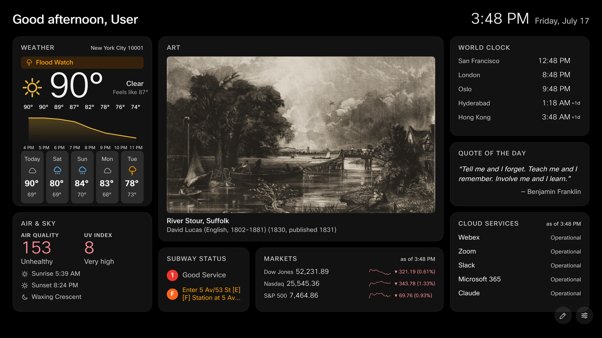

idlescreen turns the idle screen of a Cisco Board Pro or Desk Pro into a
personal dashboard: your weather, your trains, your teams, your markets, a
daily artwork. It appears when the board has nothing else to do and steps
aside the moment the board is needed for a call.

There are **no accounts and no logins**. You build your dashboard once, from
your phone or desktop, and the board remembers it through reboots and software
updates. Everything on it is optional and everything is rearrangeable by touch.

## Where to go

- **[Getting it on the board](/docs/board/point-your-board/)** — pointing a
  board at idlescreen. For whoever administers the device.
- **[Set up your board](/docs/set-up-your-board/)** — building your dashboard.
- **[Using the dashboard](/docs/using/buttons-and-navigation/)** — the
  buttons, the editor, the settings.
- **[The widgets](/docs/widgets/)** — every card, in detail.
- **[Codes & backup](/docs/codes/setup-codes/)** — how setup codes work, and
  how to back up your board before a reset.

## For developers

idlescreen is open source. Self-hosting and development documentation live in
the [GitHub repository](https://github.com/scotty83/idlescreen).
