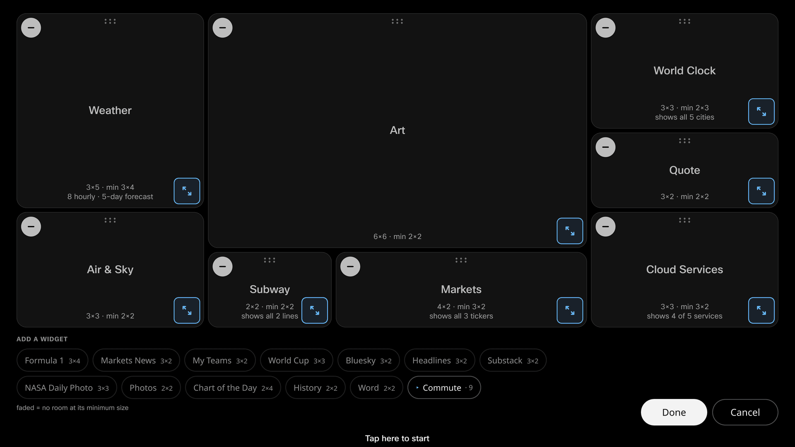

Tap the **✎ pencil** and the dashboard becomes editable. Everything happens by
touch, directly on the glass.

## Moving and resizing

- **Drag a card** to move it. Cards in the way slide aside as you go.
- **Drag a card's corner handle** to resize it. Cards snap to the grid, and
  each card has a minimum size it won't shrink past.
- **✕ removes** a card. It isn't gone — it drops into the tray at the bottom,
  ready to come back whenever you want.

A drop that doesn't fit flashes red and snaps back — you can't break the
layout by trying.

## Bigger cards show more

Most cards show more as you give them room: more departures, more tickers,
more headlines. While you're editing, each card tells you how many rows fit at
the size you've made it, so you can size cards to exactly what you want to
see.

## The tray

The tray along the bottom holds every card you're not currently using, sorted
into the same groups as [the widget guide](/docs/widgets/). Tap one to add it.
Larger groups fold into drawers to keep the tray compact.

## Done and Cancel

**Done** saves the layout to the board. **Cancel** puts everything back the
way it was, no matter how much you moved.
