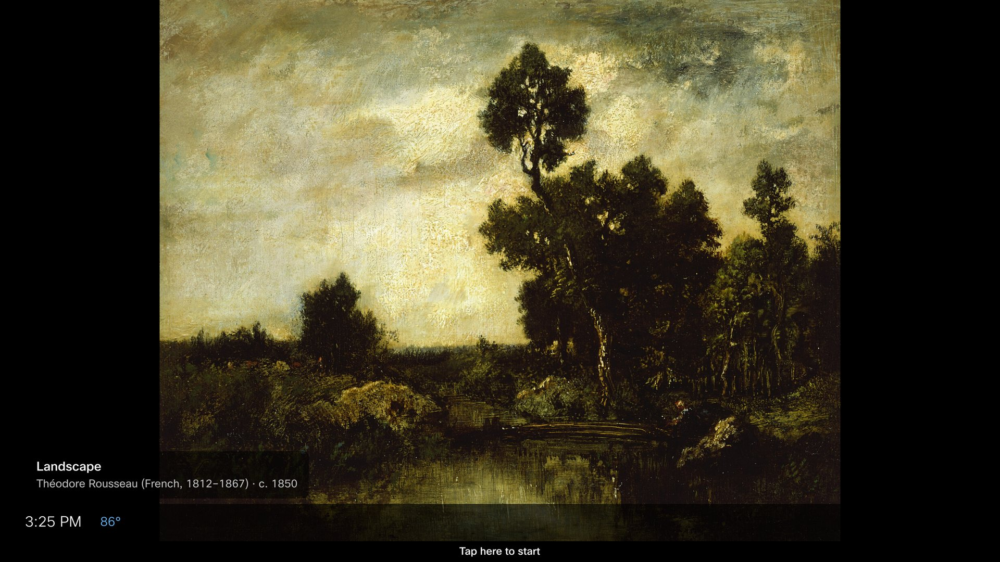

**Settings → Screensaver** picks what fills the screen when the dashboard
rests. **Settings → Display** decides when that happens.

## Screensaver options

**Slideshows**

- **Art** — a rotating public-domain artwork from major museum collections.
- **Landscapes** — a curated folder of landscape photography.
- **Your photos** — either photo widget's album ([iCloud](/docs/widgets/images/icloud-photos/)
  or [Google Drive](/docs/widgets/images/gdrive-photos/)).

**Clock faces**

- **Big clock** — a giant time and date.
- **World clocks** — an analog dial for each of your World Clock cities,
  night-time cities dimmed.
- **Clock + world times** — a big clock with a row of city times beneath.

Every option has a full-screen **Preview** — tap anywhere to exit it.

**Off** is also an option.

## Three toggles

| Toggle | What it does |
| --- | --- |
| **Info strip** | A slim band along the bottom: current weather and your next departures |
| **Hour markers** | Tick marks on the clock faces |
| **Backdrop image** | A curated photo behind a clock face — one per day |

## Display modes

| Mode | What the board shows |
| --- | --- |
| **Always dashboard** | The dashboard whenever the board is idle |
| **Always screensaver** | The screensaver whenever the board is idle |
| **Scheduled** | The dashboard during your chosen daily windows, the screensaver outside them |

Scheduled mode takes up to four windows a day, in 15-minute steps — dashboard
during office hours, art in the evening, say.

## It never goes blank

If a photo album becomes unreachable, the screensaver quietly falls back to
Art, and failing that to the Big clock. A resting board always shows
*something* composed.
